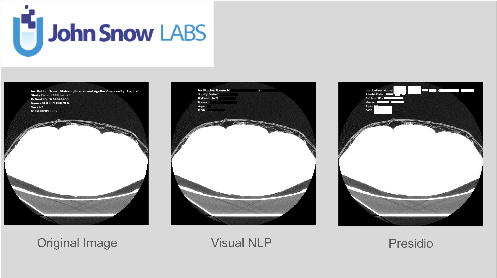
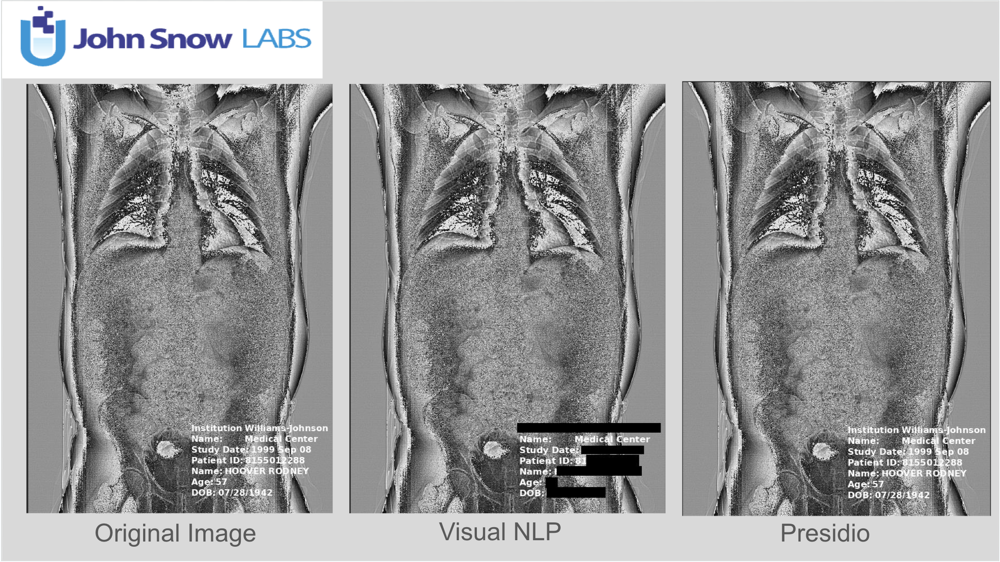
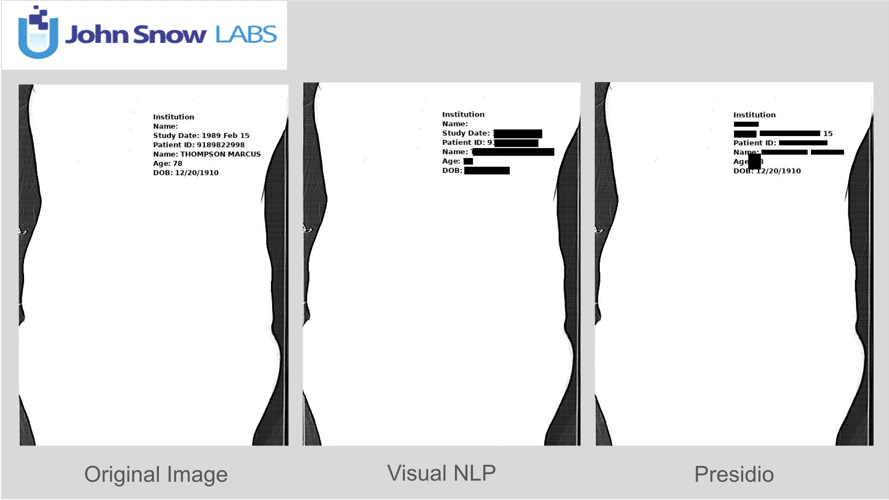

# DICOM De-identification Evaluation & Dataset

This directory contains the synthetic-overlay DICOM dataset workflow and the Visual NLP vs Presidio evaluation notebooks.

## Contents

- [Dataset](#dataset)
- [Files](#files)
- [Evaluation Setup](#evaluation-setup)
- [Metrics](#metrics)
- [Sample Results](#sample-results)

## Dataset

### Public Dataset

This dataset has been created to evaluate medical image de-identification methods. Our approach was inspired by the paper "A DICOM dataset for evaluation of medical image de-identification", which explores synthetic overlays in DICOM images. As a starting point, we used the publicly available Pseudo-PHI DICOM dataset. (See attached license for details.)

This dataset is intended to support research in medical image de-identification and text removal techniques.

### Dataset Generation Process

1. Image extraction: Images were extracted from the original DICOM files.
2. Synthetic overlay generation:
    - Metadata-derived text overlays were created, simulating patient-identifying information.
    - Two types of text annotations were generated.
    - Text overlays were placed at varying corner positions within the images.
3. Ground truth (GT) annotation:
    - The generated text annotations, along with their precise coordinates, were saved as GT annotation files.
4. Text burn-in process:
    - The synthetic text was burned into the extracted images at the corresponding coordinates.
5. New DICOM file creation:
    - The modified images (with burned-in text) were saved as new DICOM files.
    - Multi-frame DICOM files from the original dataset were split into multiple single-frame DICOM files.

### Dataset Contents

- DICOM files: Single-frame DICOM images with burned-in text overlays.
- Extracted images: Original images before text was applied.
- GT annotation files: Ground truth data containing the generated text and its coordinates.

### Evaluation Subset

We wanted to ensure our measurements were as accurate as possible, so we hand-picked a group of DICOM images to work with. We focused on choosing only the best quality images, the ones that mattered clinically. This way, we avoided any skewed DICOM data. We wanted to ensure our numbers reflected real-world medical imaging, not something artificial.

```json
[
  "292821506_07-13-2013-XR_CHEST_AP_PORTABLE_for_Douglas_Davidson-46198_1001_000000-37718_1-1.dcm",
  "339833062_07-05-2001-19638_3001578_000000-60758_1-2.dcm",
  "339833062_07-05-2001-19638_3001578_000000-60758_1-5.dcm",
  "6670427471_05-26-2000-FORFILE_CT_ABD_ANDOR_PEL_-_CD-25398_5_000000-NEPHRO__4_0__B40f__M0_4-18678_1-106.dcm",
  "6670427471_05-26-2000-FORFILE_CT_ABD_ANDOR_PEL_-_CD-25398_5_000000-NEPHRO__4_0__B40f__M0_4-18678_1-105.dcm",
  "6670427471_05-26-2000-FORFILE_CT_ABD_ANDOR_PEL_-_CD-25398_5_000000-NEPHRO__4_0__B40f__M0_4-18678_1-070.dcm",
  "6670427471_05-26-2000-FORFILE_CT_ABD_ANDOR_PEL_-_CD-25398_5_000000-NEPHRO__4_0__B40f__M0_4-18678_1-015.dcm",
  "6415974217_06-09-1988-ABDOMENPELVIS-29078_237_000000-PJN-15958_1-10.dcm",
  "6415974217_06-09-1988-ABDOMENPELVIS-29078_237_000000-PJN-15958_1-03.dcm",
  "3209648408_09-23-1999-CT_UROGRAM-31798_3_000000-PARENCHYMAL_PHASE_Sep1999-95798_1-146.dcm",
  "3209648408_09-23-1999-CT_UROGRAM-31798_3_000000-PARENCHYMAL_PHASE_Sep1999-95798_1-144.dcm",
  "3209648408_09-23-1999-CT_UROGRAM-31798_3_000000-PARENCHYMAL_PHASE_Sep1999-95798_1-137.dcm",
  "3209648408_09-23-1999-CT_UROGRAM-31798_3_000000-PARENCHYMAL_PHASE_Sep1999-95798_1-125.dcm",
  "3209648408_09-23-1999-CT_UROGRAM-31798_3_000000-PARENCHYMAL_PHASE_Sep1999-95798_1-121.dcm",
  "3209648408_09-23-1999-CT_UROGRAM-31798_3_000000-PARENCHYMAL_PHASE_Sep1999-95798_1-110.dcm"
]
```

## Files

| Path | Description |
|---|---|
| `Presidio_Metrics.ipynb` | Notebook for running Presidio metrics. |
| `Visual_NLP_Metrics.ipynb` | Notebook for running Visual NLP metrics. |
| `creds.json` | Sample Visual NLP credentials. |
| `dicom_files.zip` | Source DICOM files used by the data preparation script. |
| `dicom_image_pii_verify_engine.py` | Presidio verification helper. |
| `prepare_data.py` | Script used to generate ground truth and extract DICOM files from the ZIP archive. |
| `results/ner_result` | JSON files with NER results. |
| `results/deid_image_result` | Obfuscated final images from Presidio and Visual NLP. |

## Evaluation Setup

We created two environments to measure Visual NLP pipelines with Presidio: Google Colab and Databricks.

### Google Colab

- We used the standard A100 (40GB) GPU environment.
- Used for both Visual NLP pipelines and Presidio.

### Databricks

- 16.0 ML (includes Apache Spark 3.5.2, GPU, Scala 2.12)
- Visual NLP needs CUDA 12.x and cuDNN 9.x for our in-house ONNX models.
- Used only for Visual NLP pipelines.

## Metrics

| **Model**                                              | **Precision** | **Recall** | **F1-Score** |
|-----------------------------------------------------------|-------------|--------|----------|
| 🚀 **ImageTextDetector - MemOpt (Scala) + ImageToTextV2 - Base (Scala)** | **0.871**     | **0.800** | **0.834**  |
| 🚀 **ImageTextDetector - MemOpt (Scala) + ImageToTextV2 - Large (Scala)** | **0.892**     | **0.822** | **0.856**  |
| 🚀 **ImageTextDetector - MemOpt (Scala) + ImageToTextV3 (Scala)** | **0.741** | **0.433** | **0.547**  |
| 🐍 **ImageToText (Python)**                               | **0.436**     | **0.289** | **0.348**  |
| 🔴 **Presidio**                                           | **0.07**    | **0.128** | **0.091**  |

## Sample Results






