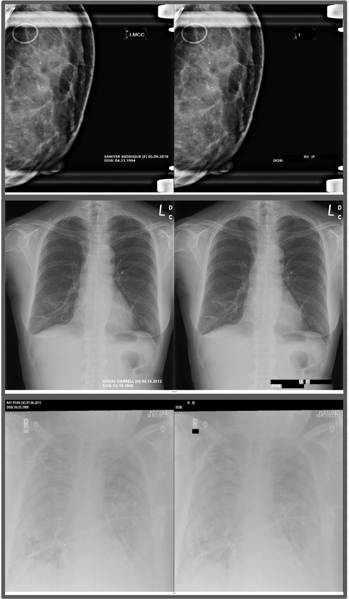
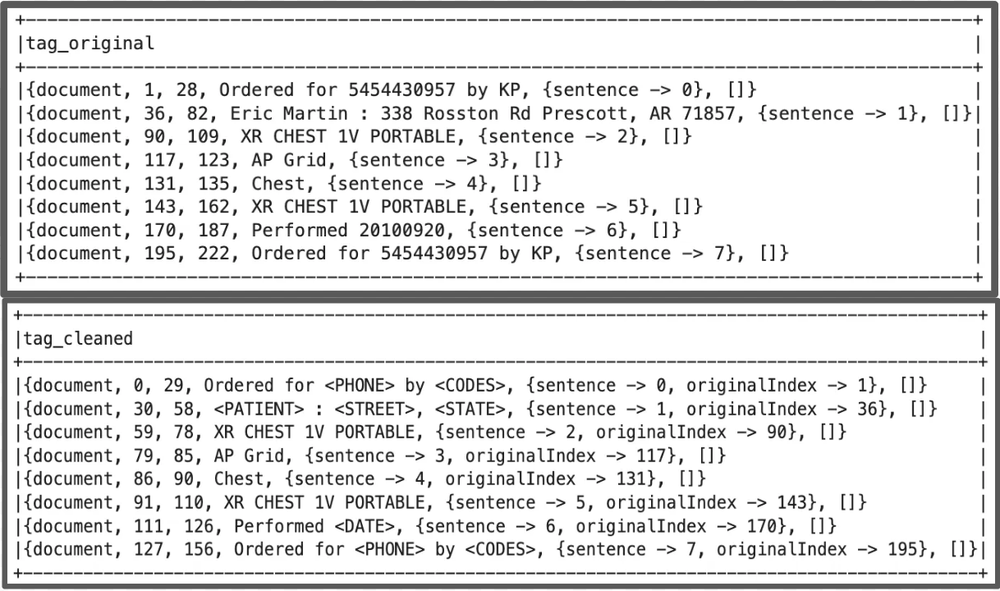

# Visual NLP DICOM Dataset and Metrics

## Presidio — Comparison of Visual NLP vs Presidio

- We use the **Pre MIDI-Pixel** Visual NLP de-identification pixels pipeline.
- A unique dataset is created for this experiment.
- Notebooks are present to run both the **Visual NLP** and **Presidio** solutions.

## Databricks Pixels Platform — Comparison of Visual NLP vs Pixels

- We use the **Post MIDI-Pixel** Visual NLP de-identification pipeline.
- The **MIDI-B** dataset is used for this experiment.
- Notebooks are present for the **Visual NLP** solution.

## Results

### Pixel De-Identification

### Metadata De-Identification

### DICOM De-Identification Flow Diagram

### DICOM Metadata De-Identification Flow Diagram

## Speed Benchmarks

### Dataset Description

- **File count:** 100 files, with 10 frames per file — **1,000 total frames**.
- **File size:** Varies from 70 MB to 400 MB per file.
- **Frame scaling:** Frames are scaled down by 75% after extraction.

### Cluster Configuration

| Role | Instance Type | GPU | vCPUs | Memory |
|---|---|---|---|---|
| Driver | m5d.16xlarge | — | 64 | 256 GB |
| Worker | g4dn.4xlarge (T4) | 16 GB | 16 | 64 GB |

### Benchmark Results

| Workers | Time Taken (s) | Cost (DBU/h) |
|---|---|---|
| 2 | 4,581.85 | 16.66 |
| 4 | 2,379.57 | 22.36 |
| 6 | 1,647.01 | 28.06 |

## References

- **Medium Article:** [De-Identifying DICOM Files: A Step-by-Step Guide with John Snow Labs Visual NLP](https://medium.com/john-snow-labs/de-identifying-dicom-files-a-step-by-step-guide-with-john-snow-labs-visual-nlp-2c21b60f92a8)
- **Visual NLP Workshop DICOM Notebooks:** [GitHub — visual-nlp-workshop / jupyter / Dicom](https://github.com/JohnSnowLabs/visual-nlp-workshop/tree/master/jupyter/Dicom)
