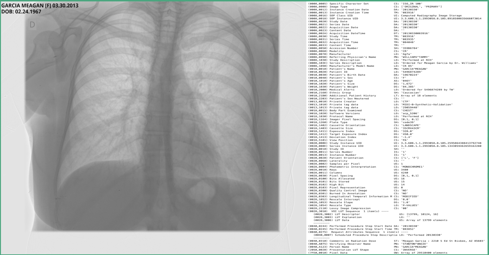
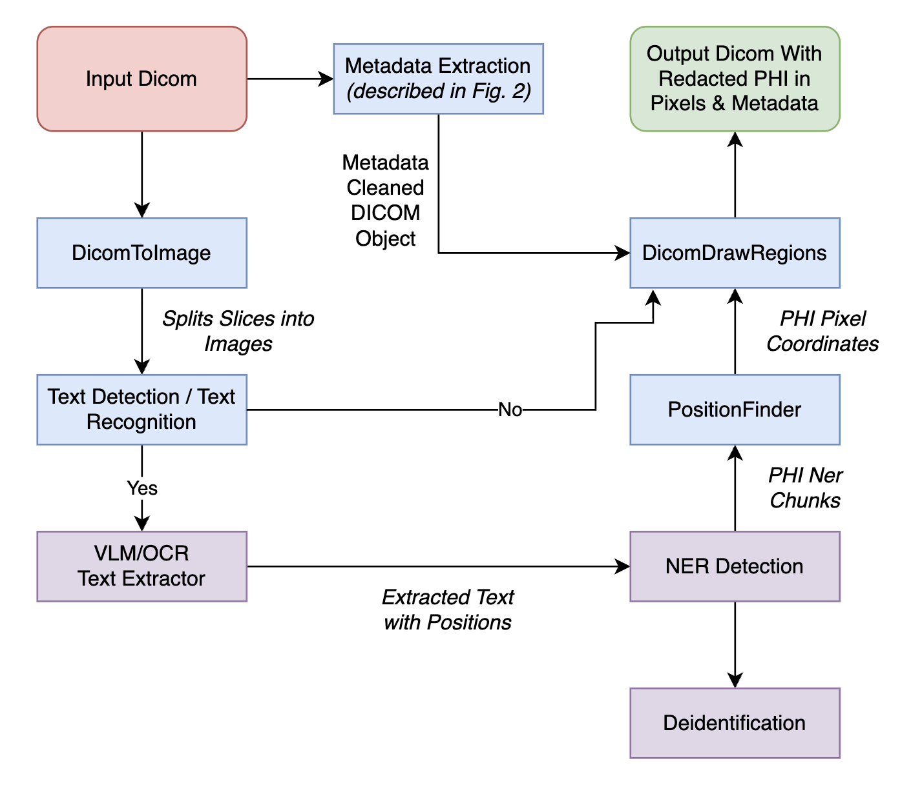
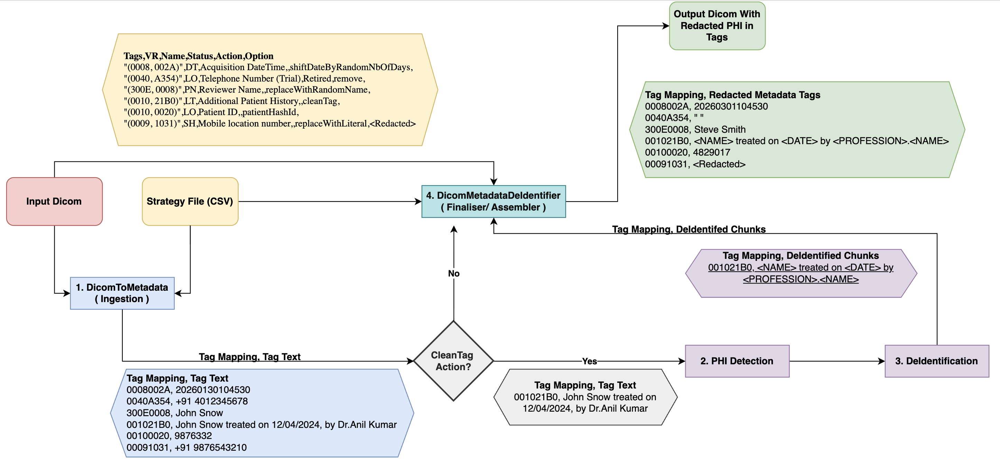
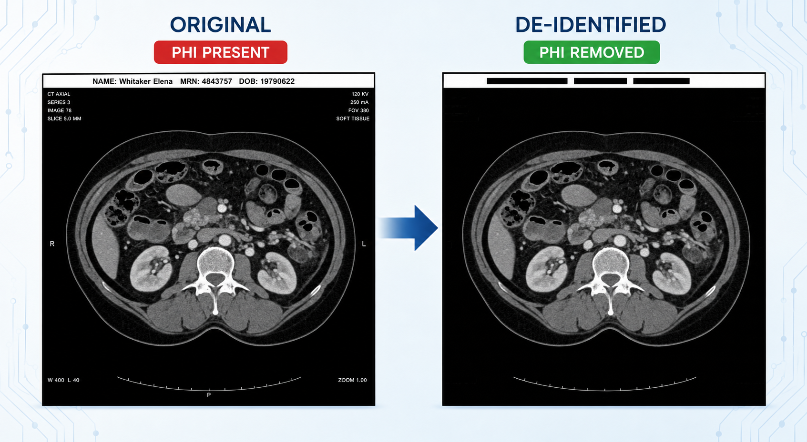
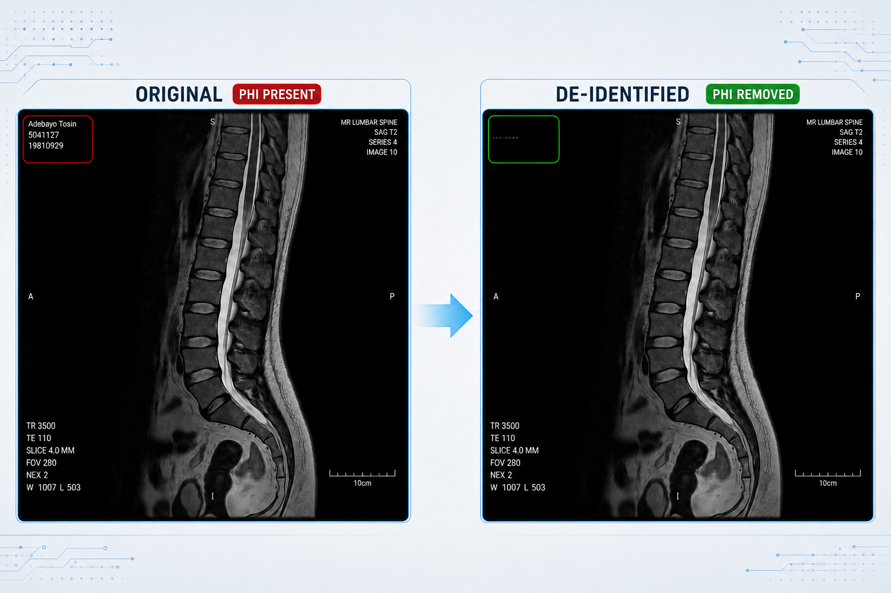
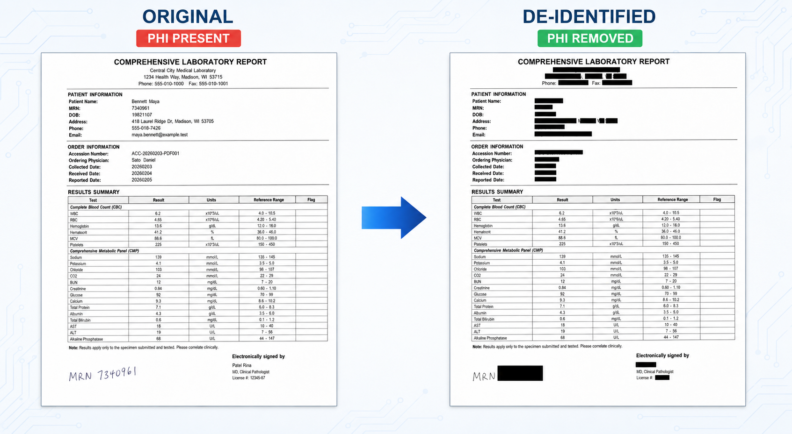
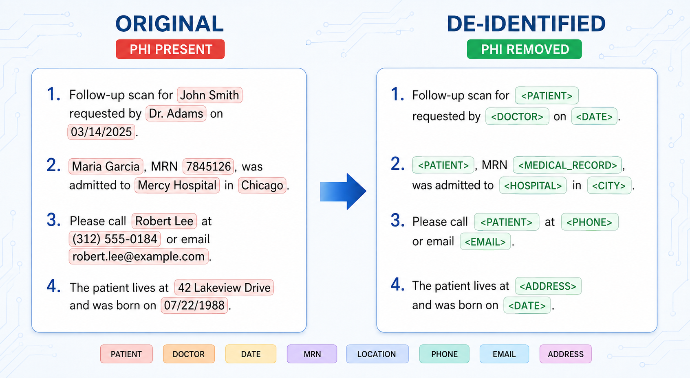

# Visual NLP DICOM Dataset and Metrics

## Overview

This repository contains DICOM de-identification datasets, notebooks, metrics, and visual results for evaluating John Snow Labs Visual NLP across comparison workflows and synthetic dataset workflows.

## Repository Structure

| Path | Description |
|---|---|
| `Presidio/` | Dataset generation and Visual NLP vs Presidio evaluation. |
| `Pixels_Platform/` | Visual NLP vs Databricks Pixels evaluation on the MIDI-B dataset. |
| `Synthetic_V2/` | Synthetic dataset with pixel PHI, PDF-encapsulated DICOM files, metadata PHI, and ground truth files. |

## Experiments

| Experiment | Dataset | Pipeline | Details |
|---|---|---|---|
| Visual NLP vs Presidio | Synthetic text overlay DICOM dataset | pre-MIDI-Pixel Visual NLP pixel de-identification pipeline | [Presidio README](Presidio/README.md) |
| Visual NLP vs Databricks Pixels | MIDI-B validation dataset | post-MIDI-Pixel Visual NLP de-identification pipeline | [Pixels Platform README](Pixels_Platform/README.md) |

## Workflow Diagrams

### DICOM De-Identification

### DICOM Metadata De-Identification

## Sample Results

### Blanket Pixel De-Identification

### PHI Pixel De-Identification

### Encapsulated PDF De-Identification

### Metadata De-Identification

## Speed Benchmark

### Dataset Description

- **File count:** 100 files, with 10 frames per file - **1,000 total frames**.
- **File size:** Varies from 70 MB to 400 MB per file.
- **Frame scaling:** Frames are scaled down by 75% after extraction.

### Cluster Configuration

| Role | Instance Type | GPU | vCPUs | Memory |
|---|---|---|---|---|
| Driver | m5d.16xlarge | - | 64 | 256 GB |
| Worker | g4dn.4xlarge (T4) | 16 GB | 16 | 64 GB |

### Benchmark Results

| Workers | Time Taken (s) | Cost (DBU/h) |
|---|---|---|
| 2 | 4,581.85 | 16.66 |
| 4 | 2,379.57 | 22.36 |
| 6 | 1,647.01 | 28.06 |

## References

| Resource | Description |
|---|---|
| [Visual NLP DICOM Workshop](https://github.com/JohnSnowLabs/visual-nlp-workshop/tree/master/jupyter/Dicom) | Visual NLP DICOM notebooks and workshop examples. |
| [DICOM De-identification Blogpost](https://medium.com/john-snow-labs/de-identifying-dicom-files-a-step-by-step-guide-with-john-snow-labs-visual-nlp-2c21b60f92a8) | Step-by-step Visual NLP DICOM de-identification walkthrough. |
| [Metadata De-identification](https://github.com/JohnSnowLabs/visual-nlp-workshop/blob/master/jupyter/Dicom/strategy_actions.md) | Visual NLP guide to metadata de-identification. |
| [MIDI/Pseudo-PHI DICOM Paper](https://www.nature.com/articles/s41597-021-00967-y) | Scientific Data paper describing a DICOM dataset for evaluating medical image de-identification. |
| [Visual NLP Skill](https://github.com/JohnSnowLabs/visual-nlp-workshop/tree/master/jupyter/skill) | John Snow Labs Visual NLP de-identification skill for your LLM. |
